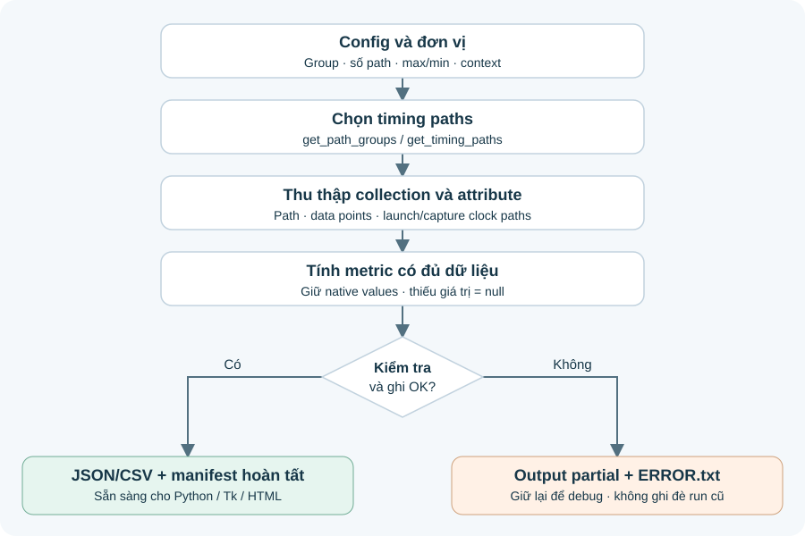
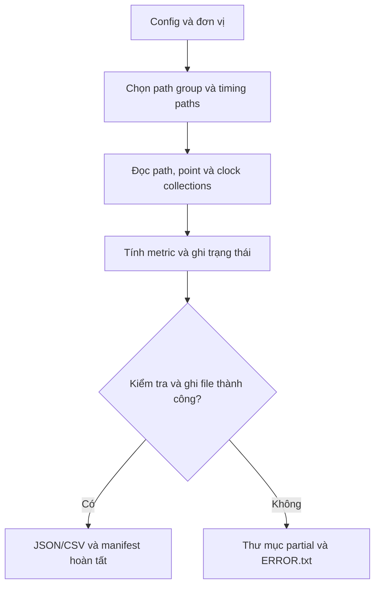

# Hướng dẫn PrimeTime Collection Exporter v1

## 1. Mục đích và phạm vi

Bộ script lấy **collection và attribute trực tiếp trong PrimeTime**. Thay đổi số cột, khoảng trắng, dòng wrap hoặc tùy chọn của `report_timing` không ảnh hưởng đến việc thu thập.

V1 làm bốn việc: chọn timing path; lưu giá trị gốc cùng nguồn attribute; tính các thành phần có đủ dữ liệu; xuất JSON/CSV có schema để đọc lại bằng Python hoặc JavaScript.

Đầu vào là **session PrimeTime đã load design, constraints, library, parasitics và có kết quả timing đúng với flow của bạn**. Không cần file timing report. Script không thay đổi constraints, SI/OCV/CPPR settings và không tự gọi `update_timing`.

Phần collector chạy bằng `source` trong **`pt_shell`**, sử dụng cú pháp Tcl 8.5+. `tclsh` độc lập chỉ chạy được phần mock test vì không có lệnh PrimeTime. Phần reader Python cần Python 3.6+ và chỉ dùng standard library.

V1 thu thập phía PrimeTime. Để so sánh với Innovus, phía Innovus cần xuất cùng schema/đơn vị và ánh xạ định nghĩa metric. Bộ này có reader và bộ ghép/compare cùng schema, **chưa có collector gọi Innovus**. Chưa xây GUI Tk/HTML; tầng dữ liệu đã tách để thêm chúng sau.

## 2. Luồng xử lý





Kiểm tra thất bại trước khi bắt đầu ghi file chỉ trả lỗi trên console. Lỗi trong lúc export giữ lại thư mục `.partial-*` để debug; tên thư mục output chính chỉ được tạo khi toàn bộ export hoàn tất.

## 3. Chạy lần đầu với 5 path

Giải nén bộ script vào một thư mục mà máy chạy PrimeTime đọc được. Sau khi session đã sẵn sàng:

```tcl
# Trong pt_shell
report_units
source /absolute/path/pt_collection_v1/pt_export.tcl

set cfg [ptx::default_config]
dict set cfg output_dir ./pt_trial_001
dict set cfg run_id pt_trial_001
dict set cfg comparison_context revA_func_ss_0p72v_125c_rcworst
dict set cfg scenario FUNC_SS_RCWORST
dict set cfg design_revision revA
dict set cfg path_groups {reg2reg}
dict set cfg max_paths_per_group 5
dict set cfg nworst 1
dict set cfg delay_type max
dict set cfg slack_lesser_than_ns 0.0
dict set cfg pba_mode none

# BẮT BUỘC khớp với report_units của session, không đoán theo tên file.
dict set cfg input_time_unit ns
dict set cfg input_capacitance_unit pf
dict set cfg formats {json csv}

ptx::run $cfg
```

`report_units` ở đây để bạn xác nhận đơn vị; script không parse report này. Hai đơn vị đầu vào để trống trong default config nhằm yêu cầu bạn khai báo. Ví dụ 1 ps được đổi thành 0.001 ns, 1 fF thành 0.001 pF. V1 nhận các đơn vị cơ bản trong bảng dưới; nếu session dùng hệ số khác như `10ps`, cần bổ sung scale rõ ràng trước khi chạy.

Có thể sửa và `source example_run.tcl` để sử dụng lại cấu hình. Output directory phải là tên mới; script không ghi đè kết quả cũ.

Ngoài PrimeTime:

```bash
python3 /path/pt_collection_v1/timing_data.py validate ./pt_trial_001
python3 /path/pt_collection_v1/timing_data.py summary ./pt_trial_001
```

Trước khi tăng số path, kiểm tra một vài path bằng `report_timing` của session để xác nhận start/end, slack, clock boundaries và ý nghĩa attribute của bản PrimeTime đang dùng. Đây là bước xác nhận triển khai, không phải đầu vào của parser.

## 4. Các tùy chọn chính

| Config | Ý nghĩa |
|---|---|
| `path_groups` | Danh sách Tcl glob patterns. `{reg2reg in2reg}` chọn hai nhóm; `{CLK*}` chọn nhóm có tên bắt đầu CLK; `{*}` chọn tất cả. Pattern không match gây lỗi. Nhóm match nhiều pattern chỉ query một lần. |
| `max_paths_per_group` | Số path tối đa **mỗi group**, không phải tổng run. Hai group với giá trị 100 có thể xuất tới 200 path. |
| `nworst` | Số path tối đa mỗi endpoint trong truy vấn native. Giá trị 1 không có nghĩa lấy mọi topology của endpoint. Phải ≤ `max_paths_per_group`. |
| `delay_type` | `max` hoặc `min`. Với FF thông thường tương ứng setup/hold. Max/min cũng có thể chứa các check khác; không đổi nhãn tất cả thành setup/hold. |
| `slack_lesser_than_ns` | Lấy slack **nhỏ hơn** ngưỡng, tính bằng ns. `0.0` lấy path vi phạm; `{}` bỏ bộ lọc, vẫn giữ giới hạn số path. Ngưỡng được đổi sang đơn vị native trước khi query. |
| `pba_mode` | `none`, `path`, `exhaustive`. Ghi lại vào metadata. Chọn theo flow; không trộn GBA/PBA khi so sánh. |
| `input_time_unit` | `s`, `ms`, `us`, `ns`, `ps`, `fs`. Phải xác nhận từ session. |
| `input_capacitance_unit` | `f`, `nf`, `pf`, `ff`. Đầu ra luôn là pF. |
| `include_clock_paths` | Mặc định 1: query `-path_type full_clock_expanded`, sau đó đọc clock path collections. Giá trị 0 bỏ phần này; network metrics sẽ thiếu. |
| `formats` | `{json}`, `{csv}` hoặc `{json csv}`. Manifest và attribute coverage luôn được ghi. |
| `comparison_context` | Khóa context chung cho hai tool, do bạn đặt sau khi đối chiếu mode/PVT/RC/constraints/analysis settings. Không đơn thuần là tên scenario của một tool. |
| `scenario`, `design_revision` | Nhãn scenario thực tế và revision design. Script không suy đoán từ tên session. |
| `slack_tolerance_ns` | Sai số cho kiểm tra `arrival/required/slack`; mặc định `0.000001` ns. |
| `fail_on_slack_mismatch` | Mặc định 1: phép kiểm tra sai thì dừng. Đặt 0 để xuất dữ liệu chẩn đoán với trạng thái `mismatch`, ví dụ khi khảo sát statistical timing. Không biến mismatch thành kết quả hợp lệ. |
| `session_kind` | `single` hoặc `worker`. Không hỗ trợ export trực tiếp từ DMSA manager. |
| `notes` | Ghi bổ sung tên constraint/parasitic/library set, điều kiện thí nghiệm hoặc thông tin flow. Không có chức năng tự hash input của session. |

Ví dụ lấy cả path MET và VIOLATED: `dict set cfg slack_lesser_than_ns {}`. Để export hold, đổi `delay_type min` và chọn output/run_id mới.

Giới hạn số path chạm ngưỡng sẽ có `limit_reached: true` ở manifest. Đây là dấu hiệu mẫu có thể bị giới hạn, không chứng minh đã lấy tất cả violations. Summary là thống kê **trên mẫu export**, không phải design TNS hay tổng endpoint vi phạm.

## 5. Output và schema

| File | Nội dung |
|---|---|
| `timing.json` | Metadata và từng path; kèm data points, clock paths, nguồn attribute và chỉ số point dùng tính toán. Nên dùng làm dữ liệu chính. |
| `paths.csv` | Một dòng/path; identity, scalar native metrics, derived metrics và trạng thái. |
| `points.csv` | Một dòng/point trong từng chuỗi. Khóa liên kết: `path_id`, `segment`, `chain_index`, `index`. |
| `manifest.json` | `schema_version`, `complete`, số path, config, lệnh query thực tế, kiểu dữ liệu, attribute map và các app variables đọc được. |
| `attribute_coverage.csv` | Thống kê số lần attribute đọc được, rỗng, không khả dụng hoặc không hợp lệ. |

Schema hiện tại là `1.0`. Các field thời gian có hậu tố `_ns`; capacitance có hậu tố `_pf`. JSON number là số, boolean là boolean. **Thiếu dữ liệu = JSON `null` / ô CSV rỗng; giá trị 0 vẫn được giữ nguyên là 0.**

`*_native_ns` giữ ngữ nghĩa và dấu của native attribute nhưng đã đổi đơn vị sang ns. Chữ `native` không có nghĩa giữ nguyên đơn vị của library. Writer không dùng chuỗi object handle làm tên path/pin.

`path_id` chỉ duy nhất trong một run. `group_rank` chỉ là thứ tự tool trả về, **không phải khóa matching giữa hai tool**. Tên hierarchy, bus index và ký tự đặc biệt được giữ; JSON/CSV đều escape khi ghi.

Trong `points.csv`, `segment` là `data`, `launch` hoặc `capture`. Data có `chain_index=0`; clock chain bắt đầu từ 1. `index` là thứ tự point bắt đầu từ 1 trong mỗi chuỗi. Một physical pin có thể xuất hiện trong data và clock chain: đó là hai ngữ cảnh riêng, không cộng cả hai để lấy tổng delay/SI.

CSV không chứa toàn bộ provenance chi tiết như JSON. `timing_data.py` đọc lại được cả JSON và CSV-only; nó từ chối export thiếu manifest hoàn tất, sai schema, thiếu field bắt buộc hoặc sai số lượng path.

## 6. Công thức và giới hạn ý nghĩa

Ký hiệu `A(p)` dưới đây là `timing_point.arrival` đã đổi đơn vị, **trong cùng một chuỗi point**. Không giả định nó bằng giá trị `Path` của text report. Clock latency, external delay và latch borrowing có thể dùng các mốc riêng; exporter lưu số gốc và chỉ lấy hiệu tại các boundary đã xác định.

| Field | Cách tính / nguồn |
|---|---|
| `slack_ns`, `arrival_ns`, `required_ns` | Native path attributes; không suy ra từ dòng cuối report. |
| `tlaunch_ns` | Arrival tại launch clock sink trừ arrival tại **nguồn của launch clock đang được chọn**, cùng một launch clock chain. Đây là network span quan sát được, không bao gồm phần trước nguồn đó. |
| `tcapture_ns` | Tương tự trên capture clock chain tới `endpoint_clock_pin`. |
| `tck2q_ns` | `A(Q) − A(CK)` của FF launch đã xác định. |
| `tdata_ns` | `A(endpoint) − A(Q)`; không bao gồm CK→Q. |
| `tdata_plus_ck2q_ns` | `A(endpoint) − A(CK)`. Không gọi hiệu endpoint−Q là data+CK→Q. |
| `phase_shift_ns` | Capture edge value trừ launch edge value. Max dùng capture close edge; min dùng capture open edge. Đây là độ cách giữa các edge native, không lấy modulo chu kỳ và không phải toàn bộ effective setup window. |
| `cppr_native_ns`, `uncertainty_native_ns` | Native attribute; giữ dấu gốc, không tự `abs()` hoặc đổi dấu theo report. |
| `setup_native_ns`, `hold_native_ns` | Native check values nếu có; không tự biến thành số có dấu trên dòng required-time report. |
| `launch_clock_latency_native_ns`, `capture_clock_latency_native_ns` | Native latency attributes. Không tự đồng nhất chúng với network-only delay hoặc source latency. |
| `point_arrival_delta_ns` | Hiệu arrival hai point liên tiếp trong chính chuỗi đó. Đây là đại lượng tính thêm, không cam kết đồng nhất cột `Incr` trong mọi report. |

Để tính CK/Q, script kiểm tra exact object name, cell sở hữu pin, cell sequential, clock-pin flag, pin direction và thứ tự point. Không hardcode tên pin `/CK`, `/CP`, `/CLK` hoặc lấy substring tên instance.

Với generated clock, nếu clock chain mở rộng có cả master path, script tìm nguồn của **selected clock** và bỏ phần trước nguồn này. Nếu không có nguồn, không có sink, hoặc nhiều clock chain cùng phù hợp, network metric để `null` cùng trạng thái lỗi/mơ hồ. Ideal clock cũng không được tự gán network delay bằng 0.

V1 không suy ra riêng **source latency** từ một latency attribute chưa rõ định nghĩa. Nếu release của bạn cung cấp attribute thích hợp, có thể thêm vào map sau khi kiểm tra man page. Source latency không có field chuẩn đoán mò trong bản này.

Với latch, input/output path, thiếu CK hoặc thiếu thông tin loại cell, script vẫn lưu native path/point data nhưng chỉ tính phần có đủ điều kiện. Không áp công thức FF một cách mặc định. Phase không tự bổ sung multicycle/edge adjustment ngoài giá trị edge native đang đọc được.

Kiểm tra slack:

```text
max: slack_recomputed = required − arrival
min: slack_recomputed = arrival − required
slack_error = slack_recomputed − native_slack
```

Kiểm tra này không chứng minh toàn bộ signoff setup đúng; nó chỉ kiểm tra nhất quán các scalar đã lấy. Các loại phân tích statistical/variation đặc biệt có thể cần metric/adapter riêng.

## 7. Crosstalk: dữ liệu để debug độ relax của Innovus

V1 đọc point attribute `annotated_delay_delta` theo map mặc định. **Tên attribute này và độ sẵn có phải kiểm tra ở release bạn đang dùng.** Không có thì lưu `null`, không dùng một pin-wide worst value thay cho giá trị path-specific.

PrimeTime mô tả SI delta theo stage (cell và fanout net), gắn với input point của path. Vì vậy các tổng chẩn đoán của V1 xét receiving pin/port trong đoạn đã chọn, bỏ incoming stage của point boundary đầu tiên. Output pin không tự được coi là một stage nữa. Với inout/topology đặc biệt, cần xác nhận cách phân loại phù hợp flow.

| Field, với `<segment>` = `data` / `launch` / `capture` | Ý nghĩa |
|---|---|
| `si_<segment>_observed_sum_ns` | Tổng **có dấu** của annotation đọc được trên các receiving point của đoạn đó. Không đủ coverage thì vẫn có thể có tổng từng phần. |
| `si_<segment>_complete_sum_ns` | Chỉ có số khi mọi receiving point đã phân loại trong đoạn đều đọc được annotation, và không có point chưa phân loại. |
| `si_<segment>_observed_count` | Số receiving point đọc được giá trị, kể cả giá trị bằng 0. |
| `si_<segment>_missing_count` | Số receiving point thiếu annotation. |
| `si_<segment>_unclassified_count` | Số point không đủ object class/direction để phân loại. |
| `si_<segment>_status` | `complete`, `partial`, `unavailable`, hoặc nguyên nhân thiếu boundary/clock chain. |

`complete` chỉ nói coverage của annotation trong đoạn được chọn, **không nói mô hình SI đã hội tụ, extraction đã đúng hoặc hai tool tương đương**. Manifest lưu một số SI/PBA/CPPR settings đọc được để truy vết, không phải toàn bộ snapshot flow.

Không cộng SI delta một lần nữa vào arrival đã có SI. Không gọi `delay − sum(delta)` là kết quả chạy SI-off. Propagated slew, derate, clock interaction và CPPR có thể làm thay đổi kết quả khi thật sự chạy lại. Nếu cần định lượng nguyên nhân slack relax, so sánh cả ba đoạn clock/data, CPPR, uncertainty và các điều kiện phân tích tương ứng.

## 8. Debug theo module

| Vấn đề | Bắt đầu xem |
|---|---|
| Sai group, số lượng path hoặc cutoff | Config, `adapter.tcl::query_paths`, `manifest.groups[].command` |
| Sai tên/thiếu attribute | `attributes.tcl`, `attribute_coverage.csv`, `timing.json -> attributes` |
| Sai tên object/cell/clock source | `adapter.tcl::object_info`, `clock_sources` |
| Sai CK/Q/endpoint hoặc clock chain | `calculate.tcl::data_boundaries`, `network_span`; xem `calculations` trong JSON |
| Sai SI aggregate | `si_summary`; kiểm tra direction, boundary, signed annotation và coverage |
| Sai JSON/CSV hoặc thêm field không xuất | `writers.tcl`, `common.tcl`; kiểm tra type mapping |
| File không hoàn tất | Console và `*.partial-*/ERROR.txt` |
| Ghép nhầm path khi compare | `timing_data.py::identity`, `topology`, không sửa bằng ghép rank |

Các lệnh kiểm tra attribute trong PrimeTime:

```tcl
list_attributes -application -class timing_path
list_attributes -application -class timing_point
man timing_path_attributes
man timing_point_attributes

# Dùng cfg đã khai báo đầy đủ ở bước chạy thử.
set ::ptx::config [ptx::validate_config $cfg]
set one [get_timing_paths -group reg2reg -delay_type max \
    -max_paths 1 -nworst 1 -path_type full_clock_expanded]
foreach_in_collection p $one {
    ptx::inspect_path $p
    ptx::inspect_points $p
}
```

Trong JSON, mỗi scalar đọc từ path/point có `attribute`, `status`, `message`. `ok` là đọc và convert được; `empty` là không có value; `unavailable` là API trả lỗi; `invalid` là sai kiểu/non-finite. `empty` hoặc `unavailable` có thể do không áp dụng trên object đó, không nhất thiết do cả release thiếu attribute.

Thêm field không cần sửa JSON/CSV writer, ví dụ `voltage` được release hỗ trợ:

```tcl
# Chạy sau khi source pt_export.tcl, trước ptx::run.
dict set ::ptx::point_fields voltage_v {number voltage}
```

Map có format `output_field {type native_attribute}`. Các type: `time`, `cap`, `number`, `bool`, `text`, `name`. `time`/`cap` tự đổi đơn vị. Dùng field mới không trùng tên có sẵn. Không đổi ngữ nghĩa một field cũ mà vẫn giữ schema version cũ. Đổi tên API tại `attributes.tcl`; sửa chính sách chọn path ở `adapter.tcl`; sửa công thức ở `calculate.tcl`.

Các field như capacitance, fanout, derate, SI delta và clock collections có thể khác giữa releases. Map mặc định là điểm bắt đầu có kiểm tra runtime, không phải cam kết mọi field luôn có trên mọi PrimeTime. Script không retry bằng cách bỏ tùy chọn query vì việc đó có thể đổi nghĩa mẫu path được lấy.

## 9. Đọc dữ liệu cho Tk, HTML và phân tích

Python không cần gọi lại PrimeTime:

```python
from timing_data import load_dataset, summarize

data = load_dataset("pt_trial_001")
print(summarize(data))

# rows có thể đưa vào ttk.Treeview, backend web hoặc công cụ vẽ biểu đồ.
rows = [
    (p["path_id"], p["startpoint"], p["endpoint"], p["slack_ns"],
     p["tdata_plus_ck2q_ns"], p["si_data_complete_sum_ns"])
    for p in data["paths"]
]

# Xếp hạng SI trên những path có đủ annotation. Đơn vị đổi ns -> ps để hiển thị.
ranked = sorted(
    (p for p in data["paths"] if p["si_data_complete_sum_ns"] is not None),
    key=lambda p: abs(p["si_data_complete_sum_ns"]), reverse=True,
)
for p in ranked[:10]:
    print(p["path_id"], 1000 * p["si_data_complete_sum_ns"], "ps")
```

JavaScript có thể dùng `JSON.parse()` hoặc `fetch()` đọc `timing.json` qua ứng dụng/local server của bạn. Khi vẽ biểu đồ, lọc `null` trước; không ép `null` thành 0. Với file lớn, dùng CSV reader theo stream hoặc chuyển dữ liệu sang SQLite ở tầng consumer. Collector ghi từng path để tránh giữ toàn bộ dataset trong Tcl; `load_dataset()` hiện đọc toàn bộ file vào RAM.

## 10. Quy tắc compare với Innovus

Hai bộ dữ liệu phải có cùng `comparison_context`, `design_revision`, `analysis_type`, `pba_mode` và đơn vị chuẩn hóa. `scenario` có thể khác tên giữa hai tool. Bạn chịu trách nhiệm ánh xạ corner/mode/constraints/RC tương ứng; một chuỗi context giống nhau không tự chứng minh hai session tương đương.

Khóa matching gồm context, group, start/end exact pin names, clocks, loại/giá trị edge, transitions và latch flags. Mặc định thêm **toàn bộ thứ tự data point + transition**. Khóa edge được làm tròn tới `1e-9 ns` chỉ để loại sai khác biểu diễn floating point; metric vẫn giữ precision khi xuất.

```bash
python3 timing_data.py compare pt_run innovus_same_schema_run \
    --match topology --tolerance-ns 0.001 --output compare_001.json
```

`delta = candidate − reference`; PrimeTime đặt ở vị trí reference. Với setup, delta slack dương có nghĩa candidate có slack lớn hơn; ý nghĩa của delta từng metric cần xem theo công thức và loại check.

`--match endpoints` bỏ điều kiện giống data topology nhưng vẫn giữ identity clock/edge/context. Kết quả có `topology_equal` để biết data sequence có khác hay không. Nó không chứng minh clock topology giống nhau.

Nếu một khóa có nhiều path ở một trong hai phía, kết quả là `ambiguous`; không tự chọn worst path hoặc ghép theo rank. Khóa thiếu dữ liệu cho việc matching là `missing_identity`; thiếu counterpart là `missing_reference`/`missing_candidate`. Path chưa có counterpart cũng không chứng minh tool kia không có path: có thể mẫu bên kia đã bị giới hạn.

**Native fields không được tự so sánh giữa hai tool.** Với CPPR, uncertainty, setup/hold có hậu tố `_native_ns`, compare trả `requires_semantic_mapping` khi metadata tool khác nhau. Muốn so sánh chúng, cần thêm metric chuẩn hóa có định nghĩa dấu rõ ràng vào cả hai adapter và cập nhật `COMPARE_FIELDS`; không đổi tên tool để vượt điều kiện này. Các metric chuẩn hóa như network span/data delay cũng chỉ có ý nghĩa nếu Innovus adapter tuân thủ đúng cùng định nghĩa.

V1 chưa lấy riêng launch/capture clock topology để làm khóa strict, chưa map tên hierarchy giữa hai netlist, chưa điều khiển Innovus query target list. Các phần đó có thể thêm ở adapter/consumer, không cần quay lại parse report text PrimeTime.

## 11. DMSA, kiểm thử và xác nhận thực tế

V1 chạy trong single-scenario session hoặc **từng DMSA worker/scenario**. Không dùng collection đã merge ở manager: tập attributes mặc định và semantics của việc chọn path ở manager khác worker. Với flow DMSA, source script trong worker theo cơ chế flow sẵn có, gán scenario/context đúng và output directory riêng cho mỗi scenario. Không để nhiều worker cùng ghi một output.

Đã kiểm thử phần Tcl bằng collection mô phỏng: công thức setup/hold, units, selection, missing/zero/negative SI, generated clock boundary, ambiguity, CSV/JSON round trip và xử lý output lỗi. Xem `TEST_RESULTS.md`.

**Chưa chạy trên PrimeTime có license trong môi trường xây bộ này.** Mock không xác nhận tên attribute hay availability của phiên bản PrimeTime bạn dùng. Bước xác nhận thực tế cần tập trung vào vài path nhỏ: đúng start/end; slack khớp; CK/Q/clock root đúng; trường thiếu thể hiện rõ; SI không bị double count. Khi đạt, tăng dần số path.

## 12. Tài liệu đối chiếu

Nguồn chính: `Primetime(1).pdf` bạn cung cấp, **PrimeTime User Guide T-2022.03**:

- Chương 5, *Working With Design Objects*: collection, `get_attribute`, liệt kê attribute và hướng dẫn tra man page của class.
- Chương 19, *Path-Based Timing Analysis*, trang in 875: lưu expanded clock paths vào collection bằng `get_timing_paths -path full_clock_expanded`; phân biệt với điều khiển PBA recalculation.
- Chương 16, *Crosstalk Delay Analysis*, trang in 584: SI theo stage và input point; cột incremental đã bao gồm SI delta.
- Chương 4, *Distributed Multi-Scenario Analysis*, trang in 116: collection merged tại manager và yêu cầu attributes.

Tham khảo bổ sung về ngữ nghĩa arrival: [trích tài liệu thuộc tính Synopsys trong hồ sơ công khai, trang 256–257](https://docs.justia.com/cases/federal/district-courts/california/candce/3%3A2013cv02965/267657/929/5.html). Tài liệu này mô tả `timing_point.arrival` có thể chưa bao gồm clock latency, input delay và latch borrowing. Vì đây là tài liệu cũ, exporter không hardcode cách cộng offset; nó giữ native values và dùng chênh lệch point trong cùng chuỗi khi đủ boundary. Man page đi kèm release đang chạy là căn cứ cuối cùng cho attribute map.
