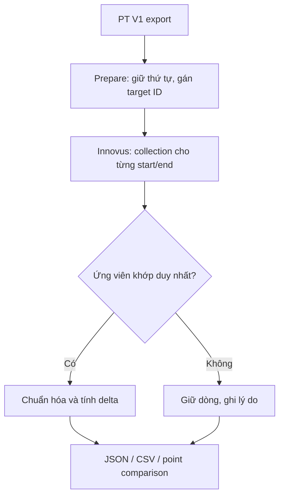

# Timing compare V2

V2 dùng danh sách path PrimeTime làm golden, hỏi Innovus theo từng start/end rồi so sánh theo đúng thứ tự PT. Không sắp lại theo WNS Innovus. Package này chỉ có collector Innovus, chuẩn hóa/compare Python và tests; không phát hành lại exporter hoặc dữ liệu V1.

## Chạy nhanh

```bash
# 1. Linux shell: tạo job từ output PT V1 có sẵn.
python3 timing_v2.py prepare --pt /work/pt_export --job /work/job_v2
```

```tcl
# 2. Innovus console: design và timing đã được flow của bạn load/update.
source /work/timing_compare_v2/innovus_collect.tcl
iv2::run /work/job_v2/targets.tcl /work/job_v2/innovus_raw.jsonl
```

```bash
# 3. Linux shell: chuẩn hóa + compare. Output directory phải mới hoặc rỗng.
python3 timing_v2.py compare --job /work/job_v2 \
  --innovus /work/job_v2/innovus_raw.jsonl --out /work/compare_v2
```

Đọc `comparison.csv` trước; `comparison.json` có lý do ghép/reject chi tiết. `golden_paths.csv` và `innovus_paths.csv` có cùng cột, cùng số dòng và cùng thứ tự.

Giả định mặc định `get_property` trả thời gian ns và điện dung pf. Nếu session dùng đơn vị khác, khai báo `--time-unit ps --cap-unit ff` ở bước prepare. Hai option chỉ khai báo đơn vị để đổi số, không thay đơn vị trong tool.

Không cần nhập scenario, không bật/tắt/reset SI. Với nhiều analysis view, chọn view cần đối chiếu bằng `--view FUNC_SS`; nếu bỏ qua mà collection có nhiều view, compare báo `multiple_views_select_view`.

## Luồng



## Các file cần sửa khi debug

| File | Trách nhiệm |
|---|---|
| `innovus_attributes.tcl` | Tên property native; đổi tại đây khi release khác nhau |
| `innovus_adapter.tcl` | Query `report_timing -collection`, đọc property, lấy pin/port chính xác |
| `innovus_collect.tcl` | Vòng lặp target, ghi trạng thái và giữ thứ tự |
| `innovus_io.tcl` | Serialize raw JSONL; chưa tính delay |
| `numeric.py` | Decimal, unit scale, lượng tử hóa, JSON numeric |
| `dataset.py` | Đọc PT V1, xác định CK/Q, normalize, tính metric |
| `timing_v2.py` | CLI, chọn ứng viên, compare, xuất CSV/JSON |
| `tests/test_v2.py` | Test dữ liệu tổng hợp, không cần report thật |

## Options

```bash
python3 timing_v2.py prepare --help
python3 timing_v2.py compare --help

# Ví dụ chọn hai group, lấy 200 path đầu theo thứ tự PT.
python3 timing_v2.py prepare --pt /work/pt_export --job /work/job_ss \
  --group reg2reg --group 'CLK_*' --max-paths 200 \
  --view FUNC_SS --candidate-limit 100 \
  --time-unit ns --cap-unit pf --quantum-ns 0.000001 --tolerance-ns 0.000001
```

| Option prepare | Mặc định / ý nghĩa |
|---|---|
| `--pt`, `--job` | Bắt buộc: PT output và thư mục job mới |
| `--group` | Tất cả group trong export; có thể lặp, hỗ trợ glob |
| `--max-paths` | Tất cả path đã chọn; giới hạn tổng, không phải mỗi group |
| `--view` | Không bắt buộc; tên analysis view Innovus, không cần trùng tên scenario PT |
| `--candidate-limit` | 50 mỗi start/end; query thêm 1 để phát hiện đã chạm giới hạn |
| `--match topology` | Mặc định: cùng chuỗi pin và transition Q→end |
| `--match endpoints` | Cho phép chuỗi data khác; vẫn phải cùng clock, edge, edge time và transition đầu/cuối |
| `--time-unit`, `--cap-unit` | ns, pf; đơn vị thực tế của giá trị native Innovus |
| `--quantum-ns` | `0.000001` = 1 fs; power of ten từ `1e-12` tới `1` ns |
| `--tolerance-ns` | `0.000001`; ngưỡng đánh giá chênh lệch, không nới điều kiện ghép path |
| `--retime` | `none`; chọn `path_slew_propagation` nếu chủ động đối chiếu với PT PBA |
| `--name-map` | JSON map tên pin/clock chính xác, ví dụ khác top prefix |
| `--semantics` | JSON khai báo các metric đã kiểm tra cùng ý nghĩa/sign giữa hai tool |

Compare có `--job`, `--innovus`, `--out`, tùy chọn `--tolerance-ns` và `--fail-unmatched`. Exit 0: đã tạo output, kể cả có dòng unmatched. Exit 1: input/lỗi chạy. Exit 2: có unmatched khi bật `--fail-unmatched`. Exit 0 không có nghĩa mọi metric đều nằm trong tolerance.

## Cách ghép path

1. Giữ nguyên thứ tự array `paths` của PT hoặc thứ tự dòng `paths.csv`; gán `T0000001`, `T0000002`…
2. PT có thể lấy CK làm startpoint, Innovus trả launching point là Q. Chỉ đổi CK→Q khi có bằng chứng cùng sequential cell từ PT; không đoán bằng tên chân. Query từ CK đã xác định để còn lấy được CK→Q nếu collection cung cấp.
3. Mỗi target query riêng `-from`, `-to`, `-late`/`-early`. Không lọc chỉ violation trên Innovus: path đã MET vẫn cần compare.
4. Kiểm tra điểm đầu/cuối native, clock, loại edge, thời điểm edge, transition đầu/cuối và topology theo mode. Không chỉ tin target ID đã gán.
5. Một ứng viên khớp duy nhất mới được ghép. Các ứng viên còn lại và nguyên nhân reject nằm trong raw/`candidate_checks`.

`candidate_limit`, `ambiguous`, `duplicate_golden`, `not_found`, `query_error`, `no_matching_candidate` đều giữ dòng trống ở đúng slot golden. Nếu chạm candidate limit, tăng giới hạn và chạy job mới; một ứng viên đang thấy khớp chưa chứng minh các ứng viên chưa thu thập không trùng.

Tên có bus `[3]`, `$`, space được quote ở Tcl và escape pattern khi tìm object. Name map không thay tên theo regex hoặc fuzzy matching. Path group trong CSV là nhãn group từ golden, không khẳng định tên group Innovus giống PT.

## Số học và metric

Tool values trong raw JSONL có `raw`, `value`, `property`, `kind`, `status`, `message`. `raw` là chuỗi tool trả, `value` numeric dùng `%.17g`. Python đọc Decimal, đổi đơn vị một lần và tính trên số chưa làm tròn. Cuối cùng metric của cả hai phía được làm tròn cùng quantum bằng half-up; delta tính từ hai giá trị đó. JSON/CSV dùng cùng số. Raw không bị ghi đè.

| Metric | Định nghĩa / điều kiện |
|---|---|
| `slack_ns` | Slack native; `delta > 0` nghĩa Innovus relax hơn PT |
| `tck2q_ns` | A(Q) − A(CK), hai điểm phải cùng chuỗi arrival |
| `tdata_ns` | A(end) − A(Q) khi xác định được Q |
| `tdata_plus_ck2q_ns` | A(end) − A(CK), cùng chuỗi |
| `tlaunch_ns`, `tcapture_ns` | A(clock sink) − A(clock source) trong một clock chain xác định; không lấy native clock latency thay thế |
| `phase_shift_ns` | Capture edge − launch edge cho FF; max dùng capture close edge, min dùng open edge |
| `si_data_ns`, `si_launch_ns`, `si_capture_ns` | Tổng signed net delta tại receiver, chỉ có khi coverage đầy đủ |
| `cppr_native_ns`, `uncertainty_native_ns` | Giá trị native giữ nguyên; compare cần xác nhận sign/meaning qua profile |
| `arrival_native_ns`, `required_native_ns` | Giữ để debug; mặc định chưa so sánh trực tiếp vì có thể khác gốc thời gian |

Không cộng crosstalk delta vào data delay đã chứa SI. `si_data_ns` không phải toàn bộ thay đổi slack khi chạy lại SI-off: timing window, slew, clock paths và CPPR còn có thể đổi. Không kết luận nguyên nhân chỉ từ một tổng delta.

`slack_check` kiểm tra max: required − arrival; min: arrival − required; so với slack native của **chính tool đó**. Mismatch giữ nguyên dữ liệu và ghi `native_reference_mismatch`, không tự thêm/bớt clock start để ép khớp. Native slack vẫn có thể dùng so sánh nếu identity đúng.

## SI, CPPR và uncertainty

Property clock path, SI delta, CPPR, uncertainty có thể khác giữa các release. V2 probe từng property; thiếu hoặc không hợp lệ thì ghi unavailable, không trả 0 và không tự chuyển sang pin.max_* không thuộc timing path.

Trong session thật, kiểm tra các property một lần:

```tcl
source /work/timing_compare_v2/innovus_collect.tcl
set paths [report_timing -collection -late -max_paths 1 -path_type full_clock]
foreach_in_collection path $paths {
    iv2::probe $path
    break
}
```

Sửa `innovus_attributes.tcl` theo kết quả `report_property`/help của release đang dùng. Ví dụ `arrival_time` là path property, `arrival` là timing-point property; không hoán đổi tùy tiện. Với clock collection, cấu hình `clock_collection_kind` là `path` hoặc `points` đúng loại trả về. Nếu API không cho clock points thì network delay và SI clock để null, native latency vẫn nằm trong raw.

Để bật so sánh SI, copy `semantics.example.json` thành file riêng và đổi:

```json
{
  "si_delta_contract": "receiver_net_delta",
  "cppr_factor": null,
  "uncertainty_factor": null,
  "native_times_comparable": false
}
```

Dùng `--semantics /work/semantics.json` khi prepare. Đây là khai báo rằng bạn đã kiểm tra cả `annotated_delay_delta` PT và property Innovus đang trỏ tới **signed net delta ở receiver**, không phải cell delta/gộp cell+net. Nó không thay bất kỳ SI setting nào trong tool. Nếu chưa xác nhận, để `unverified`: vẫn export giá trị hai bên, trạng thái compare là `requires_semantic_mapping`.

`cppr_factor`/`uncertainty_factor`: null = chưa so; 1 = cùng sign/định nghĩa với PT; -1 = cùng đại lượng nhưng ngược sign. Chỉ đổi sau khi kiểm tra property và setup/hold convention. Không dùng `abs()` để che khác dấu. Profile áp dụng cho toàn job, vì vậy tách job nếu corner/mode có convention khác.

`native_times_comparable: true` chỉ bật nếu cùng gốc thời gian đã được xác minh và cả hai native slack checks đều OK. Để false không cản compare native slack hoặc các span delay.

## Output để debug, Tk, HTML và chart

| Output | Nội dung |
|---|---|
| `job/targets.tcl` | Job và danh sách query theo PT |
| `job/innovus_raw.jsonl` | Một record mỗi target, toàn bộ ứng viên, property status, query command và footer complete |
| `golden.json`, `innovus.json` | Cùng schema V2, array path giữ thứ tự golden; có metrics, points, clock points, coverage và native audit |
| `golden_paths.csv`, `innovus_paths.csv` | Cùng cột và slot, missing là ô trống |
| `comparison.csv` | Một dòng mỗi target, các cột PT/Innovus/delta/status/within_tolerance cho từng metric |
| `comparison.json` | Matching reasons và kết quả đầy đủ |
| `point_comparison.csv` | Step delay, slew và SI từng point; chỉ ghép khi cả chuỗi pin/transition khớp |
| `summary.json` | Số target matched/missing/ambiguous và số path slack relax/tighten trong mẫu |

`point_comparison.csv` tránh so trực tiếp absolute arrival khác gốc; dùng step delay của các điểm kế nhau. Clock chain khác topology vẫn có thể so tổng span nếu cùng root/sink; không zip các point khác tên. Summary chỉ nói về tập path PT đã chọn, không phải WNS/TNS toàn chip.

Python dùng API thuần trong `dataset.py`/`numeric.py`; GUI tương lai có thể đọc JSON với `json.load` để plot, hoặc `numeric.read_json` nếu cần giữ Decimal cho tính toán. V2 chưa bao gồm Tk/HTML/chart UI.

## Phạm vi và giới hạn đã biết

- Mục tiêu chính là FF setup/hold có đủ clock identity và pin topology. Latch borrowing, unconstrained, clock-gating/recovery/removal đặc biệt và I/O không đủ clock identity chưa có mô hình ghép chuyên biệt; có thể thành unmatched hoặc metric unavailable, không suy diễn thành FF.
- Netlist, constraints, parasitics, corner và analysis intent phải tương ứng giữa session PT/Innovus. Scenario label không kiểm chứng được các điều kiện này. Job hash chỉ chống lấy nhầm/chỉnh sửa file job; không xác thực trạng thái database.
- PT `pba_mode=none` ghép GBA mặc định. PT path/exhaustive cần chủ động chọn Innovus retime; hai thuật toán PBA không được coi là tương đương hoàn toàn chỉ vì cùng dùng path-based analysis.
- Có thể đọc export PT chỉ CSV, nhưng V1 CSV không lưu đủ clock-source list như JSON. Khi không biết root clock, network/clock SI để unavailable. Ưu tiên `timing.json` để đủ dữ liệu.
- Các tên property tùy release trong adapter chưa được chạy trên Innovus có license tại môi trường này. Core collection API dựa trên tài liệu; hãy dùng probe nếu coverage thiếu. Không có fallback parse report text.
- Tests chạy trên Python 3.12 và Tcl 9.0.4 qua tkinter headless; code dùng cú pháp Python 3.6+ và Tcl 8.5+, chưa kiểm chứng runtime cũ trong môi trường này.

## Tests

```bash
# Ở thư mục package, không cần data thật hoặc pip.
python3 -m unittest discover -s tests -v
```

Tests tạo dữ liệu tổng hợp trong thư mục tạm rồi xóa. Bài test collector dùng Tcl interpreter từ tkinter (không mở cửa sổ) và giả lập EDA commands; nếu máy không có tkinter thì test Tcl được skip, tests Python vẫn chạy.

## Tài liệu đối chiếu

- `28007780.pdf`, Innovus User Guide 23.14 (Feb 2025): phần timing collection/PBA, khoảng trang in 1922; setup/hold reporting khoảng trang in 1772. Ví dụ collection dùng `report_timing -collection`, `get_property`, `foreach_in_collection`.
- `Primetime(1).pdf`, PrimeTime User Guide T-2022.03: timing path/point collection; PT V1 vẫn là nguồn dữ liệu đầu vào.
- [Cadence: timing-path collections và cách truy vấn properties](https://community.cadence.com/cadence_technology_forums/f/digital-implementation/12582/need-guidance-to-develop-a-script-to-get-the-number-of-logic-levels-from-an-encounter-timing-report).
- [Cadence: collection trả bởi report_timing](https://community.cadence.com/cadence_technology_forums/f/digital-implementation/1383/cte-tcl-to-get-one-timing-path).

Các forum xác nhận API và một số property cơ bản; không thay thế property help của release bạn đang dùng.
